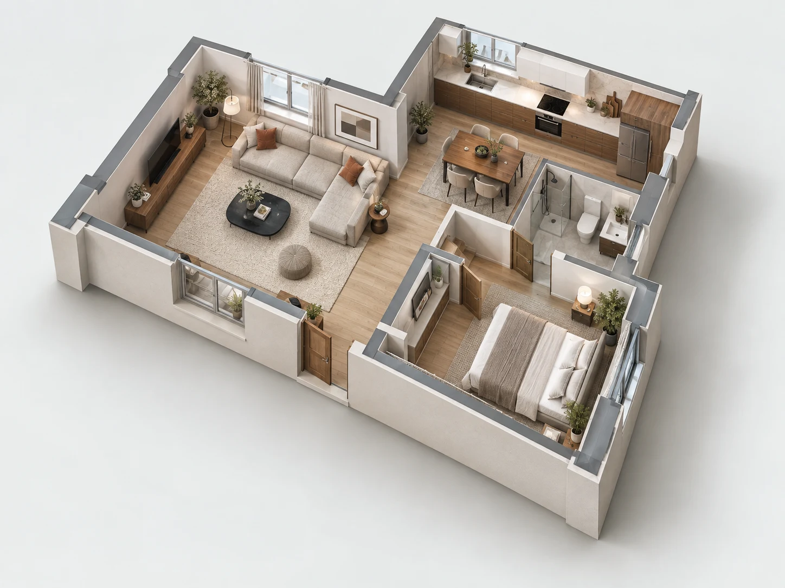

# 3D Website & Interactive Floor Plan Showcase

### Built by Appcodie · LiDAR, RoomPlan, Web & Mobile Development

**Turn a space into an experience people can explore.**

A small, runnable selection from our Codezlet showcase: an interactive spatial
blueprint and a furnished 3D house explorer. Built with JavaScript, Canvas and
Three.js, with sample measurements and responsive layouts.

[Explore the complete website](https://codezlet.com/) ·
[Discuss your project](https://www.appcodie.com/contact?utm_source=github&utm_medium=readme&utm_campaign=3d_demo) ·
[About Appcodie](https://www.appcodie.com/)



## Try it in two minutes

Requires Node.js 18 or newer. No package installation, API keys or build step.

1. Download this repository as a ZIP and extract it, or clone your copy.
2. Open a terminal in the folder containing `package.json`.
3. Run:

```bash
npm start
```

Open **http://127.0.0.1:4173**. Stop with Ctrl+C.
ES modules must be served over HTTP; double-clicking `index.html` may not work.
Alternatively, use `python -m http.server 4173 --bind 127.0.0.1` from this folder.

## Explore the demos

| Section | Try this | Implementation |
| --- | --- | --- |
| Spatial blueprint | Select any room; switch between 3D view and top view; scroll through the story | Canvas2D isometric projection with DOM buttons |
| Furnished house | Open the explorer; select rooms; drag to orbit; zoom; change metres to feet | A real Three.js/WebGL procedural scene |
| Project enquiry | Follow the contact button and describe your idea | Direct Appcodie contact-page link |

Use Tab and Enter to select controls. In the house viewport, use arrow keys to
rotate, +/− to zoom and Home to reset. Escape closes the modal. Motion respects
the operating system's reduced-motion setting. Unsupported graphics devices
receive a selectable room preview instead of the WebGL model.

**All measurements are fictional sample data.** The two demos use different
sample layouts. The browser does not perform LiDAR scanning. Room capture needs
a separately developed native app on supported hardware. This is not an appraisal
calculator, a certified UAD implementation, or a Fannie Mae/Freddie Mac endorsement.

## Custom 3D website, LiDAR & appraisal software development

Looking for a development team to turn a scanning, inspection or 3D product idea
into a working application? Appcodie develops custom experiences for businesses,
product teams and founders.

| Development service | What we can discuss for your project |
| --- | --- |
| **3D website development** | Interactive architectural experiences, product viewers and browser-based 3D interfaces |
| **LiDAR scanning app development** | Guided capture, room data and native iOS scanning workflows |
| **Apple RoomPlan app development** | Room capture integration, structured geometry and review interfaces |
| **Custom floor-plan app development** | 2D/3D views, room labels, measurements and editing workflows |
| **Home inspection software development** | Property records, inspection checklists, photos, reports and dashboards |
| **UAD 3.6 appraisal software development** | Uniform Appraisal Dataset reporting requirements, data collection and integration planning |
| **Web & mobile app development** | iOS, Android, Flutter, web dashboards, APIs and connected cloud services |

### Planning a UAD 3.6 reporting product?

Bring your **Uniform Appraisal Dataset (UAD)** requirements, existing report
formats and intended integrations to the discussion. We can scope the data
capture, validation, review and reporting features your product needs.

For projects involving **Fannie Mae or Freddie Mac reporting workflows**, the
applicable specifications and acceptance criteria must be reviewed for the
specific implementation. This repository demonstrates spatial interfaces; it
contains no UAD report generator, submission integration or compliance certification.

**[Book a free project discussion](https://www.appcodie.com/contact?utm_source=github&utm_medium=readme&utm_campaign=3d_demo).**
Tell us your target users, platforms, must-have features and intended timeline.
The link opens an enquiry form; it does not automatically reserve a calendar slot.

Email: **admin@appcodie.com** · Based in **Mohali, Punjab, India**.

## What is included?

This repository contains only the two selected visual demos, their shared assets,
a services/contact section, local Three.js dependencies, and development helpers.

It excludes the production homepage, walking/scanning character, customer projects,
analytics setup, backend services, and production SEO/content pages. It is not the
full Codezlet source code. No API credentials or account configuration are required.

## Make a change

- `index.html`: selected sections and enquiry links.
- `showcase.css`: standalone page layout and responsive styles.
- `blueprint.mjs` / `blueprint-geometry.mjs`: drawing and selection behaviour.
- `roomplan-demo.mjs`: the three-room blueprint's sample dimensions.
- `house-data.mjs`: the four-room house's sample metadata and measurements.
- `house-model.mjs`: walls, furniture and procedural materials.
- `house-viewer.mjs`: camera, selection, rendering and pointer controls.
- `house-showcase.mjs`: modal, room inspector and fallback behaviour.

Changes to room bounds also require corresponding model and preview hit-map changes;
editing dimensions alone does not regenerate the house automatically.

## Check the demo

```bash
npm test
```

Checks cover room selection, view switching, projection at several viewport sizes,
unit conversion and procedural house geometry. These are logic checks, not a
substitute for checking actual rendering on your target mobile devices.

## Repository name & discoverability

Suggested repository name: **`3d-floorplan-lidar-showcase`**.

Suggested GitHub topics: `threejs`, `webgl`, `3d-website`, `floor-plan`, `floorplan`,
`lidar`, `roomplan`, `proptech`, `house-inspection`, `javascript`, `appcodie`.
These describe the demonstration and its application areas; UAD services are
explained above separately from the features included in the code.

## Publish your repository

See [GITHUB-SETUP.md](GITHUB-SETUP.md) for a suggested repository name, description,
topics, push commands and optional GitHub Pages setup.

## License and attribution

This is a **source-available evaluation showcase**. You may clone, fork and run it
for learning and evaluation under [LICENSE.txt](LICENSE.txt). Contact us for
commercial reuse. Appcodie branding remains reserved. Three.js retains its MIT
license; see [THIRD_PARTY_NOTICES.md](THIRD_PARTY_NOTICES.md).

If you find the demo useful, a star helps other developers discover it. For project
enquiries, use the contact link rather than posting private requirements in issues.
